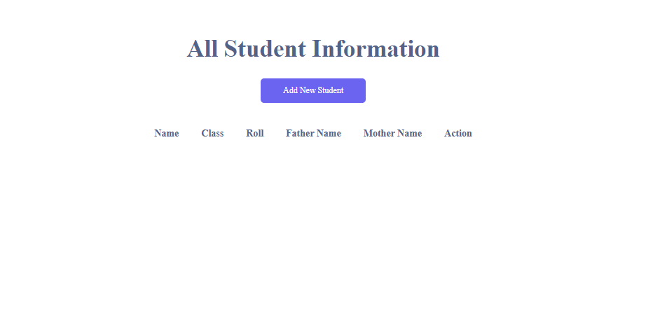
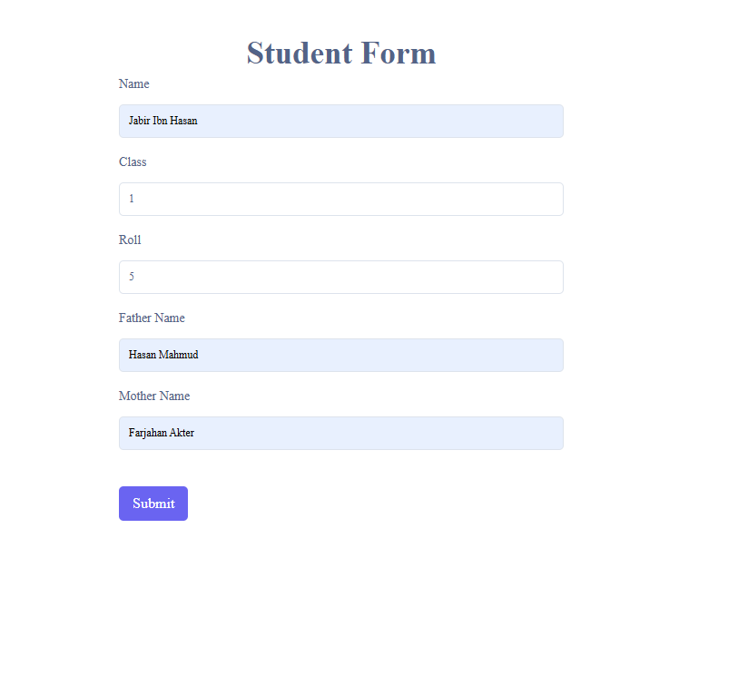
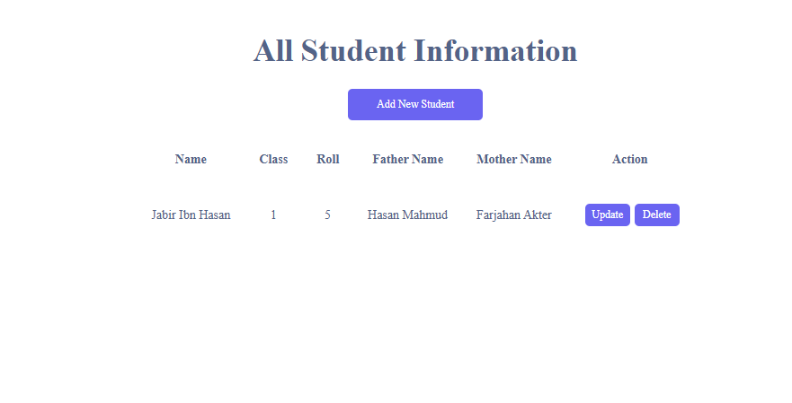

# Deployment Guide for Java Spring Boot, MySQL, and Angular on Ubuntu Server

This document provides a comprehensive guide for deploying a Java Spring Boot application with a MySQL database and an Angular frontend on an AWS EC2 instance running Ubuntu 22.04. The deployment follows a traditional approach where the Spring Boot application runs as a system service and the Angular application is served by Nginx.

---

## Application Screenshots

 
  
 

---

## Prerequisites

- **AWS EC2 Instance**: Ensure you have an EC2 instance running Ubuntu 22.04 or later, with security groups configured to allow inbound traffic on ports 22 (SSH), 80 (HTTP), and 8080 (application access).
- **Local Virtual Machine**: Alternatively, you can set up a local VM (using tools like VirtualBox, VMware, or Hyper-V) running Ubuntu 22.04 or later on your own computer. Make sure to configure the VM’s network settings to allow access to ports 22, 80, and 8080 from your host machine or local network.
- **Java**: OpenJDK 17 or later.
- **MySQL**: MySQL server installed and configured.
- **Node.js and npm**: Required for building the Angular application.
- **Nginx**: To serve the Angular application.

---

## Deployment Steps

### 1. Set Up the EC2 Instance

- **Deployment Environment**:
For this deployment, an AWS EC2 instance running Ubuntu 22.04 (or later) will be used as the server environment.

- **Launch an EC2 Instance**: Use the AWS Management Console to launch an Ubuntu 22.04 instance.
- **Connect to the Instance**: SSH into your EC2 instance using your key pair.

  ```bash
  ssh -i your-key.pem ubuntu@your-ec2-public-dns
  ```

### 2. Install Java

- **Update Package Index**: Ensure your package index is up-to-date.

  ```bash
  sudo apt update
  ```

- **Install OpenJDK**: Install Java Development Kit.

  1. Visit the [downloads](https://jdk.java.net/archive/) page to obtain the latest build version link. Then, use the following wget command to download the package. Here’s an example of downloading OpenJDK 18 version.

  ```bash
  wget https://download.java.net/java/GA/jdk18/43f95e8614114aeaa8e8a5fcf20a682d/36/GPL/openjdk-18_linux-x64_bin.tar.gz
  ```
  2. Once the download process is complete, extracting the archive.

  ```bash
  tar -xvf openjdk-18_linux-x64_bin.tar.gz
  ``` 
  3. Moved the JDK 18 directory to `/usr/local/`\
  ```bash
   sudo mv jdk-18 /usr/local/
  ```
  4. Set the JAVA_HOME environment variable to point to the JDK 18 installation.\
   ```bash
   export JAVA_HOME=/usr/local/jdk-18
   ```
  5. Added the bin directory of the JDK to your PATH.\
   ```bash
   export PATH=$JAVA_HOME/bin:$PATH
   ```
  6. To add the JAVA_HOME and PATH variables permanently in your .bashrc file, 

  ```bash
  vim ~/.bashrc
   ```

  ```bash
  # Set JAVA_HOME environment variable
  export JAVA_HOME=/usr/local/jdk-18
  # Add JDK bin directory to PATH
  export PATH=$JAVA_HOME/bin:$PATH

  ```
  7. Reloaded the shell configuration to apply the changes.\
   ```bash
   source ~/.bashrc
   ```
 
    Checked the Java version to confirm the installation.\
    `java --version`


### 3. Install Maven

  ```bash
  wget https://dlcdn.apache.org/maven/maven-3/3.9.9/binaries/apache-maven-3.9.9-bin.tar.gz
  tar -xvf apache-maven-3.9.9-bin.tar.gz
  mv apache-maven-3.9.9 /opt
  sudo mv apache-maven-3.9.9 /opt
  M2_HOME='/opt/apache-maven-3.9.9/'
  PATH="$M2_HOME/bin:$PATH"
  ```

  `vim ~/.bashrc`

  Add the following lines to the end of the file make permanent environment variables:

  ```bash
  export M2_HOME='/opt/apache-maven-3.9.9'
  export PATH="$M2_HOME/bin:$PATH"
  ```
  `mvn -v`

### 4 Install MySQL

- **Install MySQL Server**: Install the MySQL server package.

  ```bash
  sudo apt install mysql-server -y
  sudo mysql
  ```

  ```sql
  ALTER USER 'root'@'localhost' IDENTIFIED WITH mysql_native_password BY 'password';
  ```

- **Secure MySQL Installation**: Run the security script to set up MySQL.

  ```bash
  sudo mysql_secure_installation
  ```

  ```bash
  sudo mysql -u root -p
  ```

- **Create Database and User**:

  ```sql
  CREATE DATABASE studentdb;
  CREATE USER 'student_user'@'localhost' IDENTIFIED BY 'Password#4321';
  GRANT ALL PRIVILEGES ON studentdb.* TO 'student_user'@'localhost';
  FLUSH PRIVILEGES;
  EXIT;
  ```

### 5. Install Nginx

```bash
  sudo apt update
  sudo apt install nginx -y
```

### 6. Deploy the Spring Boot Application

- **Clone application  from GitHub**: 

  ```bash
   cd /home/ubuntu
   git clone https://github.com/linckon/Deploying-Like-it-s-2005.git
  ```
  Go to backend project directory and update the MySql database ConnectionString

  ```bash
  cd Deploying-Like-it-s-2005/api
  sudo vim src/main/resources/application.properties
  ```
  
  Update the values:

  ```bash
  spring.datasource.url=jdbc:mysql://localhost:3306/studentdb
  spring.datasource.username=student_user
  spring.datasource.password=Password#4321
  ```

  Build the Spring Boot Application:

  ```bash
   cd student-management-app/api
   mvn clean install -DskipTests
   cd target/
  ```

  - after making .jar file move your jar file to `mv student-0.0.1-SNAPSHOT.jar /var/www/html`

  - Now,run it with java -jar student-0.0.1-SNAPSHOT.jar. The app should start on the default port (usually 8080).

  - To keep it running in the background, use nohup java -jar student-0.0.1-SNAPSHOT.jar &
  
  - For a more robust setup, turn it into a system service so it starts on boot and restarts if it crashes.

  - **Create Systemd Service**: Create a service file for your application.

  **Note**  Make sure your JDK and Maven path which java which mvn for systemd service.

    `sudo vim /etc/systemd/system/student-backend.service`


  - **Service File Content**:

    ```bash
    [Unit]
    Description=Student Backend Service

    [Service]
    Type=simple
    Restart=always
    User=root
    Group=www-data

    # Define the log files
    StandardOutput=append:/var/log/student-backend.service.log
    StandardError=append:/var/log/student-backend.service.error.log

    # Project root path
    WorkingDirectory=/var/www/html/

    # Command to execute the JAR file
    ExecStart=/usr/local/jdk-18/bin/java -jar /var/www/html/student-0.0.1-SNAPSHOT.jar

    [Install]
    WantedBy=multi-user.target
    ```

- **Start and Enable Service**:

  ```bash
  sudo systemctl daemon-reload
  sudo systemctl start student-backend.service
  sudo systemctl enable student-backend.service
  systemctl status student-backend.service
  ```

- **Health Check Endpoint**: 
Verify the server is running and healthy by calling the health check endpoint.

  Endpoint:

  GET /api/health

  ```bash
  curl http://<ip>:8080/api/health
  ```

  Expected Response:

    OK  

    The server will respond with OK and HTTP status code 200 if it is up and running.

### 7. Install Node.js and Build Angular Application

- **Install Node.js**:

  ```bash
  curl -o- https://raw.githubusercontent.com/nvm-sh/nvm/v0.39.3/install.sh | bash
  source ~/.bashrc
  nvm list-remote
  nvm install v18.18.2
  node -v
  ```

- **Install Angular CLI**:

 ```bash
  sudo npm install -g @angular/cli
 ```
 Navigate to your frontend project directory and run the following commands:

-  **Build Angular Application**:
  ```bash
  npm install
  npm run build

  ```
**Move the Dist Directory to Your Nginx Web Server Root Directory**

  ```bash
  sudo mv dist /var/www/html
  ```

### 8. Configure NGINX to Serve Angular Application

- Navigate to the NGINX configuration directory:

  ```bash
  cd /etc/nginx/sites-available/
  ```
- Open the default NGINX configuration file:

 ```bash
  sudo vim default
  ```

- Update the configuration to point to your Angular application's build directory.
Replace the existing root path with the path to your Angular app’s dist folder. For example:

  ```bash
  root /var/www/html/dist/client;
  ```

  - Save the file and restart NGINX:

  ```bash
  sudo systemctl restart nginx
  ```
 
### 9. Access the Application

After configuring NGINX and starting the server, open your web browser and navigate to your server’s address (for example, http://your-server-ip/).
You should see the Student Entry user interface.

You can now perform all CRUD (Create, Read, Update, Delete) operations successfully through the UI.
 
---

This guide provides a structured approach to deploying your applications on an Ubuntu Server on EC2 instance. Follow each step carefully to ensure a successful deployment.
